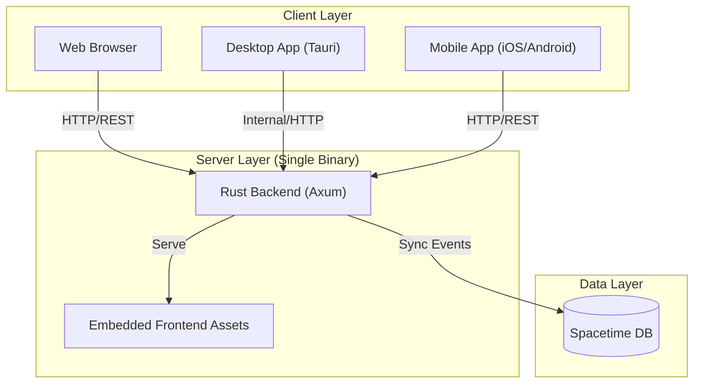

# Synapse Architecture Documentation

## Overview

Synapse is a cross-platform clipboard manager designed to run as a persistent background service with a unified UI available via local applications (desktop/mobile) or web browsers.

The core design philosophy is a **Single Binary** architecture for ease of deployment, where the backend server embeds and serves the frontend application.

## System Architecture



## detailed Components

### 1. Frontend (`/frontend`)

The frontend is built using **Dioxus**, a Rust-based library for building user interfaces that can target Web, Desktop, and Mobile from a single codebase.

-   **Framework**: Dioxus 0.6+
-   **Language**: Rust
-   **Build Targets**:
    -   `Web`: Compiles to WebAssembly (`wasm32-unknown-unknown`) for browser access.
    -   `Desktop`: Wrapped via Tauri v2 for native system integration (macOS, Windows, Linux).
    -   `Mobile`: Wrapped via Tauri v2 (iOS, Android).

**Key responsibilities**:
-   Displaying clipboard history.
-   Managing user settings.
-   Real-time UI synchronization (Synced Input, Synced Router).

### 2. Backend (`/backend`)

The backend is a high-performance HTTP server written in **Rust** using the **Axum** web framework.

-   **Framework**: Axum
-   **Language**: Rust
-   **Key Libraries**:
    -   `tokio`: Asynchronous runtime.
    -   `rust-embed`: Embeds the compiled frontend static files into the binary.
    -   `tower-http`: Middleware (CORS, file serving).
    -   `tracing`: Logging and instrumentation.

**Key responsibilities**:
-   **API Server**: Handles REST API requests from clients.
-   **Static File Server**: Serves the compiled Dioxus frontend (SPA) from memory/binary.
-   **Clipboard Sync**: Manages data flow between clients and the database.

### 3. Data Storage (Planned)

The project utilizes **Spacetime DB** for real-time synchronization capabilities.

**Concepts**:
-   **Synced Page Router**: User navigation state is stored in the DB, allowing the UI state to persist and sync across devices.
-   **Synced Input**: Real-time input synchronization across devices.

## Build & Deployment Flow

1.  **Frontend Build**:
    The Dioxus frontend is built in `release` mode.
    ```bash
    cd frontend && dx build --release
    ```
    Output location: `target/dx/frontend/release/web/public`

2.  **Asset Embedding**:
    The Backend uses `#[derive(RustEmbed)]` to include the contents of the frontend output directory at compile time.

3.  **Backend Build**:
    The backend compiles into a single executable containing all logic and assets.
    ```bash
    cd backend && cargo build --release
    ```

4.  **Runtime**:
    Running the backend binary in root directory:
    ```
    ./target/release/backend
    ```
    The resulting binary listens on `0.0.0.0:3000` (default) and serves both the API endpoints and the static SPA.

5.  **Native App Build (Tauri)**:
    Tauri wraps the Dioxus frontend in a system WebView.
    -   **Desktop**: Running in root directory
        ```
        cargo tauri build
        ```
        produces artifacts in `target/release/bundle/` (e.g., `dmg`, `msi`, `deb`).
    -   **Mobile**: Running in root directory
        ```
        cargo tauri android/ios build
        ```
        produces contents in `src-tauri/gen/android/app/build/outputs/apk` or iOS Xcode archive.
    
    *Note: The native app currently communicates with the backend services via HTTP (or planned internal IPC).*
